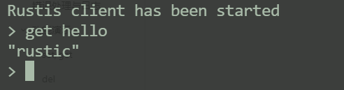
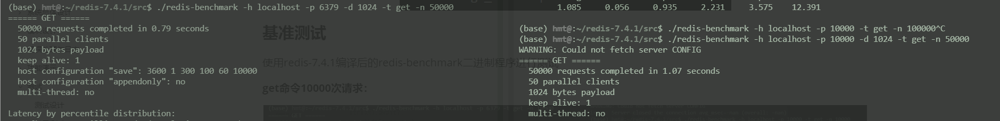

# 系统设计说明书

## 项目概述

**项目名称：** Rustis

**项目背景：** 兼容Redis协议的内存键值数据库系统（DBMS）。将数据放在内存中，以便能够快速地读写数据，可以提供持久化选项，将内存中的数据异步保存到磁盘中。

**开发语言：** Rust

**主要功能：**

- [x] 实现基本的命令解析客户端
- [x] 支持多客户端并发访问
- [x] 实现增删改查操作
  - [x] set key value
  - [x] del key
  - [x] get key
- [x] 实现pub/sub消息通信模式
- [x] 支持持久化功能
  - [x] RDB快照
  - [ ] AOF持久化

## 系统总体设计

### 架构设计

Rustis将遵循客户端-服务器架构，主要模块包括：

- 网络通信模块：基于TCP连接实现客户端与服务器，采用异步方法，支持并发客户端请求
- 命令解析模块：解析客户端输入的命令，并调用响应的数据存储结构执行操作
- 数据存储和持久化模块：负责数据结构的存储与操作；将数据持久化到磁盘，实现数据恢复功能

### 设计目标

1. 数据存储与操作：实现对核心数据结构的增、删、改、查操作，pub/sub消息通道以及持久化存储
2. 高效性：通过Rust的零成本抽象和异步编程模型提升网络并发处理能力
3. 扩展性：模块化设计，为未来功能扩展提供支持

## 模块设计

### 网络通信模块

**目的：** 实现客户端与服务器之间的TCP通信，支持多客户端连接

**功能设计/方案：**

- 使用tokio crate处理异步TCP连接
- 通过broadcast channel监听/处理服务器关闭信号，清理资源。
- 处理连接的数据帧解析/写入/读取（使用了bytes crate）
- 解析客户端的输入命令并响应（需要集成命令解析模块）

**代码结构：**

- `client`：
  - `mod.rs`：客户端接口实现，并暴露给lib外部使用（包括客户端`connect`方法和各种命令的接口）
- `server`：
  - `listener.rs`：监听来自客户端的连接，通过tokio实现并发accept连接的操作，并进行了服务器关闭时的处理
  - `handler.rs`：负责处理来自客户端的连接，读取请求帧并进行处理，然后将响应写到socket中。（目前还没有实现pipeline，无法处理交叉帧，也就是每个连接同时处理多个请求的能力）
  - `shutdown.rs`：监听服务器关闭的信号，通过广播channel实现，主要是为了通知系统的各个部分进行相应的关闭操作，实现资源的清理
  - `mod.rs`：对上述文件进行了集成，通过`run`接口暴露给lib外部使用

- `networking`：
  - `connection.rs`：实现了连接的解析数据帧、写入数据帧、读取数据帧的功能
  - `frame.rs`：实现了`Frame`结构体，是cli和server之间通信的数据单元，符合RESP协议（是redis的序列化文本协议）。格式是特殊字符标识+数据长度（-1表示空值）+数据：
    - `+`：表示Simple(String)
    - `-`：表示Error(String)
    - `:`：表示Integer(u64)
    - `$`：表示Bulk(Bytes)【Bytes使用了bytes crate，是一个高效处理字节缓冲区的库】
    - `*`：表示Arr(Vec\<Frame\>)
  - `parse.rs`：用于解析数据帧，主要是暴露接口给命令解析模块
  - `mod.rs`：对上述文件进行集成

### 命令解析模块

**目标：** 解析客户端发来的命令并执行相应的数据操作

**功能设计/方案：**

- 支持简单的redis命令格式
  - del key：删除键
  - get key：获取键对应值
  - ping：检查服务器是否存活
  - publish channel(s) message：向channel发布message
  - save：主动保存一次rdb快照
  - set key value：设置键
  - subscribe channel(s)：订阅channel
  - unknown：未知命令
- 解析字符串格式命令，并调用相应数据存储模块接口
- 处理未定义命令或参数错误，返回错误信息

**代码结构：**

- `cmd`
  - `del.rs`：del命令的实现
  - `get.rs`：get命令的实现
  - `ping.rs`：ping命令的实现
  - `publish.rs`：publish命令的实现
  - `save.rs`：save命令的实现
  - `set.rs`：set命令的实现
  - `subscribe.rs`：subscribe命令的实现
    - 需要注意的是，当客户端执行subscribe命令后，客户端就会转变为订阅者模式，此时只能执行subscribe和unsubscribe命令，不能执行其他命令了，只能退出订阅者模式才行。
  - `unknown.rs`：unknown命令的实现
  - `mod.rs`：对上述命令的集成，暴露接口`apply`给到网络通信模块

### 数据存储和持久化模块

**目标：** 

- 实现数据的存储、检索和修改
- 将数据写入磁盘以支持数据的持久化存储

**功能设计/方案：**

- 实现set，get，del等字符串操作
- 数据持久化：将数据序列化为二进制格式保存到rbd文件中
- 数据恢复：启动时读取rdb文件，并反序列化数据存储到`Database`结构体对象

**代码目录：**

- `persistence`：
  - `database.rs` ：
    - 实现了`Database`结构体，为其实现了一系列方法，包括get、set、pub/sub以及保存/加载RDB快照等
    - 通过一个后台任务来处理过期的键
    - 因为Database对象需要在多线程之间传输并修改，为其用Arc指针封装实现了线程安全（不用Rc因为线程不安全），Mutex加锁继续封装提供内部可变性（因为Arc指针本身不具备内部可变）
  - `mod.rs`：对上述文件进行集成

## 错误处理与日志

- 错误处理：对于解析错误或操作错误，返回标准化错误信息，使用Rust标准库的Result、Ok、Err枚举即可
- 日志记录：因为使用了异步并发，通过tracing crate可以更好地记录日志信息，再通过tracing-subscribe收集并日志信息进行标准输出或文件输出，帮助排查问题

## 功能演示

为了进行功能演示，实现了两个简单的可执行程序（`client.rs`和`server.rs`），主要是两个命令行程序，`client.rs`还支持了历史命令的查询和执行。

**server.rs用法：**

运行命令：

```bash
cargo run --bin server -- --port 6379
```

- port：服务器运行端口，如果没有指定默认是6379

**client.rs用法：**

运行命令：

```bash
cargo run --bin client -- --hostname 127.0.0.1 --port 6379
```

- hostname：服务器ip地址，不指定默认为127.0.0.1
- port：服务器端口，不指定默认为6379

### set/get


### del


### ping


### pub/sub


**再订阅一个通道channel2：**


**取消订阅channel1：**


**在订阅者模式执行其他命令：**


**退出订阅者模式（ctrl+c）：**


### expire

**设置键的过期时间为5s：**


### rdb

**可以手动使用save命令进行rdb快照，或者退出服务器时自动执行一次rdb快照：**


**关闭服务器后再次启动后连接：**



## 测试

### 测试设计

- 单元测试：针对数据存储模块、命令解析模块编写单元测试
- 集成测试：模拟客户端连接服务器，执行多种命令组合进行测试
- 基准测试

### 单元测试

**database.rs**

- test_get_and_set：测试Database的get()和set()
- test_get_nonexistent_key：测试获取不存在的键
- test_subscribe_and_publish：测试Database的publish()和unsubscribe()
- test_publish_without_subscribers：测试发布到没有订阅者的channel
- test_rdb_save_and_load：测试保存rdb和加载rdb

**connection.rs**

- test_write_decimal：测试write_decimal()
- test_write_value：测试write_value()
- test_read_and_write_frame：测试read_frame()和write_frame()

**client/mod.rs：**

- test_ping：测试ping()
- test_get：测试get()
- test_set：测试set()
- test_publish：测试publish()
- test_subscribe：测试subscribe()

**测试结果：**


### 集成测试

**tests/client.rs**

- ping_pong_without_message：测试一个简单的PING PONG
- ping_pong_with_message：测试一个带有消息的PING PONG
- key_value_get_set：测试一个简单的GET SET
- key_value_timeout：试有过期的GET SET
- receive_message_subscribed_channel：测试一个简单的PUBLISH SUBSCRIBE
- receive_message_multiple_subscribed_channels：测试客户端是否能从多个订阅的channel中接收消息
- unsubscribes_from_channels：测试客户端是否能退订多个channel


**tests/server.rs**

- key_value_get_set：测试一个简单的GET SET
- key_value_timeout：测试一个带有过期时间的GET SET
- pub_sub：测试一个简单的PUBLISH SUBSCRIBE
- manage_subscription：测试订阅channels的管理
- send_error_unknown_command：测试发送未知命令
- send_error_get_set_after_subscribe：测试在订阅后尝试GET SET，应该返回错误


### 基准测试

使用redis-7.4.1编译后的redis-benchmark二进制程序进行测试

**get命令10000次请求：**


- redis：0.15s
- rustis：0.24s

**get命令100000次请求：**


- redis：1.65s
- rustis：2.40s

**大数据测试(1KB，5000次请求)：**



- redis：0.79s
- rustis：1.07s

## 未来扩展

- 数据结构扩展：支持列表j、集合等更多数据结构
- 分布式支持：实现数据分片与分布式存储
- 扩展命令：添加事务、脚本执行等高级命令支持

## 依赖说明

**tokio：** 是一个用于异步编程的crate，提供了一个基于事件驱动的运行时，可以构建高性能的异步应用程序。

**bytes：** 用于处理bytes缓冲区的crate，提供了高效的byte序列操作，在网络编程和IO操作中非常有用。

**atoi：** 用于将字节数组解析为整数的crate，它提供了高效的ASCII到整数的转换功能。

**clap：** 是一个用于解析命令行参数的crate，提供了一种简单且强大的方式来定义和处理命令参数和选项，使得编写命令行工具变得更加容易。支持自动生成帮助信息、验证参数、处理子命令等功能。Rustis将利用它完成运行客户端和服务器两个命令。

**async-stream：** 简化异步流的创建和使用

**tracing：** 用于结构体日志记录的crate，适用于异步编程环境

**tracing-appender：** 提供了将日志输出到文件的功能

**tracing-subscriber：** 是tracing的订阅者实现，收集日志

**bincode：** 是一个高效的二进制序列化和反序列化库

**serde：** 是一个用于序列化和反序列化数据结构体的框架

**crossterm：** 是一个跨平台的终端操作库，提供了控制终端的输入输出、颜色、光标等功能

# 参考

- [mini-redis](https://github.com/tokio-rs/mini-redis)
